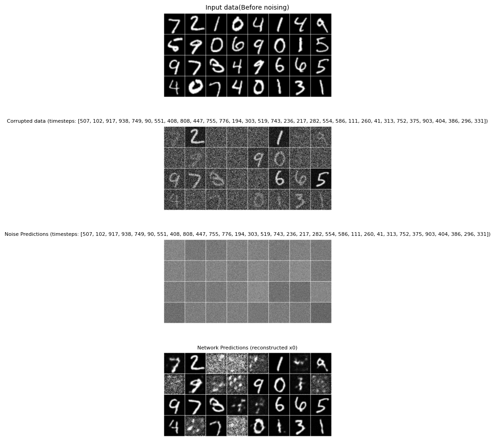
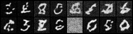
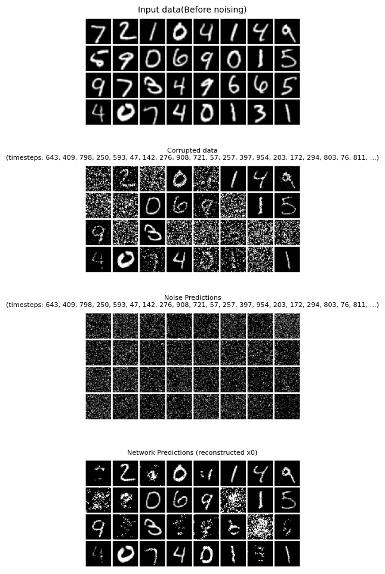
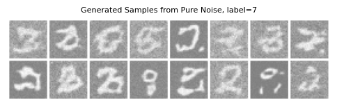

# Tests - from zero to hero

|*Basic UNET - No added timesteps*|
|:--:|
||

|*Basic UNET - Added timesteps*|
|:--:|
||

|*Prediction with Custom dataset*|
|:--:|
||

|*Evaluation of trained UNET on MNIST dataset - 10 timesteps*|
|:--:|
||
|:--:|

|*Evaluation of trained UNET on MNIST dataset - 1000 timesteps*|
|:--:|
||
|:--:|

## Tests with label embedding

|*Evaluation of trained UNET on MNIST dataset - 1000 timesteps*|
|:--:|
||
|:--:|

|*Generated images of 7 from text*|
|:--:|
||
|:--:|

## Tests with added projections - 20 epochs

|* Test with added projections, and forced 32x32 image|
|:--:|
||
|:--:|

||
|:--:|

||
|:--:|

||
|:--:|
