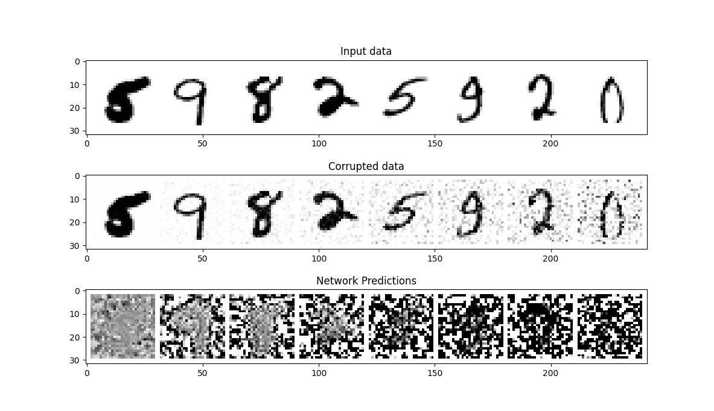
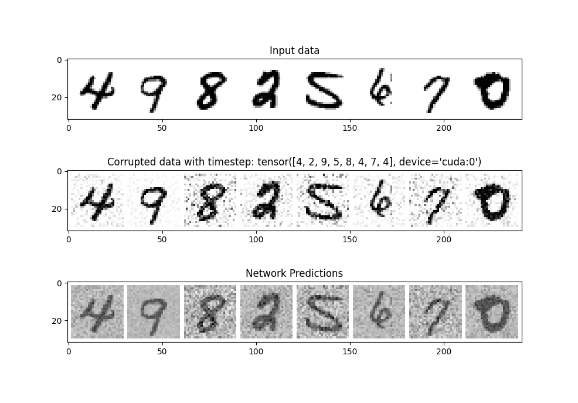
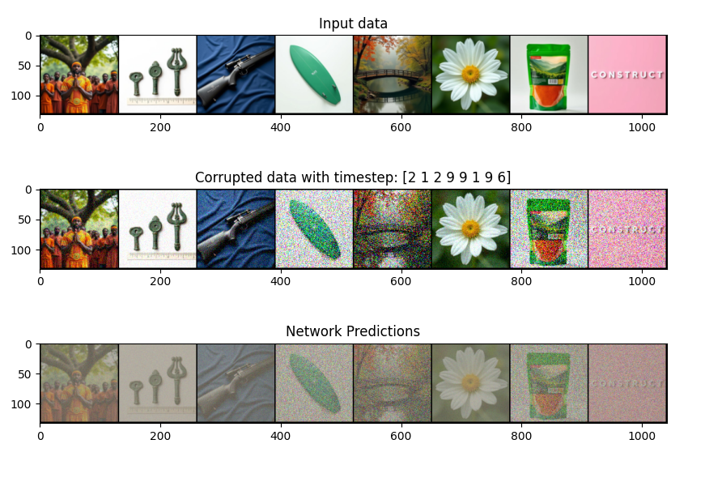

# Text-to-Image

This project will try to create a text-to-image model using the dataset text-to-image-2m from Hugging Face.

The process involves creating a network from scratch using PyTorch, train the model, and then try to generate an image based on a simple text prompt.

## The dataset

The dataset consist of prompts that describes images, and the image itself.

## PyTorch with Cuda enabled

PyTorch will be utilized to create a UNET model as well as training the model. It will also be used to enable training on a GPU, which will make the training time faster.

## File structure

The files are divided into tasks that is needed to be done in order to train the model. The files are data, model, utils, playground, train and eval.

- The file Data prepares the data by fetching it from HuggingFace, and then loading it for usage.
- Model is used to create the UNET model
- utils are several helper functions used in different files which prevent code redundancy
- playground is used to inspect and analyze the dataset, wit h the help of helper functions explained previously
- train is used to train the model with the noisy images from the dataset
- eval is used to evaluate the trained and saved models

## Goal

### Required

    - Requires VAE (compress input, then decode it back)
    - Tokenizer and encoder (text string into numerical representation)
    - UNET (numeric representation can be feed into UNET as conditioning )
    - Noise Scheduler (PNDMScheduler, LMSDiscreteScheduler)

#### Step 1

The first goal will be to apply noise to the images, then learn a UNET model to predict the noise level an image contain, so it can de-noise it later.

#### Step 2

Create a UNET that takes in "timesteps" in order to predict the denoise level of an image.

#### Step 3

Adjust noise level for proper predictions

## Tests

